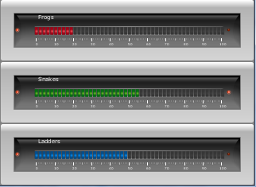

GaugeGenerator
==============

A Java program that lets you create animated guages of various sorts, and save a series of image files of them. These files can be displayed on an LCD picture frame or computer screen saver, yielding the appearance of some kind of control panel.





No programming necessary!
-------------------------
The input to the program is a simple text file, like this

```
# type,         title,    x,   y,   w,   h, min, max, update, walk
LinearBargraph, Frogs,    0,   0, 320, 78,   0, 100,    345,    5
LinearBargraph, Snakes,   0,  78, 320, 78,   0, 100,   1234,    5
LinearBargraph, Ladders,  0, 156, 320, 78,   0, 100,    123,    5
```

This creates a window with three bargraphs (currently the only type of graph produced, but that will change soon!)
that perform random walks of the data at different rates.


Credits & Thanks
-------

Thanks to 'Harmonic Code' for the "SteelSeries" Java swing component library that I use to 
create the display. See http://harmoniccode.blogspot.com/2010/08/java-swing-component-library.html

2015 update: The SteelSeries library seems not to be available in its old location, 
and I can't find a JAR for for it anywhere. The source code is now available on 
[GitHub|https://github.com/HanSolo/SteelSeries-Swing]
but it's source only, so I've created a JAR to include here in my project.
Please check the GitHub site to see if you might want to update this.

